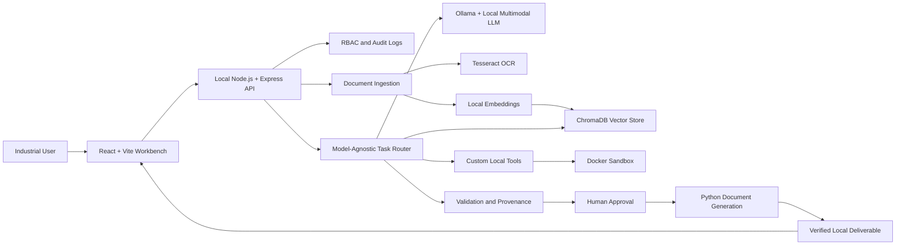

# SOVARA AI

## Smart India Hackathon 2026

| Field | Value |
| --- | --- |
| Problem Statement ID | 26117 |
| Problem Statement | Sovereign On-Premise Agentic AI Workbench using Open-Weight Multimodal LLMs for Confidential Industrial Work |
| Theme | Smart Automation |
| Category | Software |
| Team ID | T6 |
| Team Name | T6 |

Sovara AI is a sovereign, on-premise agentic AI workbench for confidential industrial operations. It is designed to keep documents, prompts, inference, tools, generated outputs, and audit records inside an organization's infrastructure. The workbench brings together local multimodal models, document intelligence, retrieval-augmented generation, tool execution, provenance, and human approval in one controlled workflow.

This repository currently contains the React/Vite frontend prototype. The interface represents the intended end-to-end product experience; the local AI runtime, RAG service, OCR pipeline, sandbox, API, and database are the planned integration layers.

## Why Sovara AI

Industrial knowledge is spread across SOPs, manuals, reports, scanned PDFs, images, drawings, and legacy documents. Sending this material to cloud AI services can create confidentiality, compliance, and operational risks. Generic chatbots also stop at answering questions when industrial teams need a complete, verifiable workflow.

Sovara AI addresses this with:

- **Sovereign processing:** sensitive data stays on the organization's workstation or server.
- **Local knowledge layer:** documents are indexed for semantic search and evidence-grounded answers.
- **Agentic workflows:** the system can plan, use tools, execute, verify, and deliver results.
- **Multimodal understanding:** scanned reports, photographs, handwritten notes, and engineering documents can be processed locally.
- **Trust fabric:** provenance, audit logs, role-based access, sandboxing, and human approval make actions traceable.
- **Model-agnostic architecture:** local open-weight models can be added or replaced without redesigning the workbench.

## Product Screens

The frontend includes these routes:

| Route | Screen | Purpose |
| --- | --- | --- |
| `/dashboard` | Dashboard | Workspace metrics, activity trend, system health, and pending approvals |
| `/dashboard/workspace` | AI Workspace | Context-aware analysis chat, attached documents, trace, and evidence sources |
| `/dashboard/tasks` | Tasks | Reserved route for task orchestration |
| `/dashboard/knowledge` | Knowledge Hub | Reserved route for local knowledge collections |
| `/documents` | Documents | Searchable registry, upload area, processing states, and document detail pane |
| `/deliverables` | Deliverables | Generated artifact cards, export actions, and document history |
| `/approvals` | Approvals | Human review of generated inspection notes and supporting evidence |
| `/security` | Security Center | Sovereignty metrics, audit timeline, access control, and security events |
| `/profile` | Profile | Local user identity and account details |
| `/settings` | Settings | Workspace processing and notification preferences |
| `/notifications` | Notifications | Recent approval, document, and security events |

## Architecture Flow

The intended product flow keeps confidential data inside the organization's network.



## Technical Approach

### Implemented in this repository

- React 19 for the component-based interface.
- Vite for local development and production bundling.
- React Router for route-based navigation.
- Lucide React for interface icons.
- CSS-based design system for layout, color, typography, states, and responsive behavior.
- Local UI interactions for search, selection, upload feedback, export feedback, prompt submission, and approval actions.

### Planned integration architecture

These technologies are part of the proposed Sovara AI system and are not all included in this frontend repository yet:

- **AI runtime:** Ollama with a local open-weight multimodal LLM.
- **Task orchestration:** LangChain and custom tool calling.
- **Task routing:** model-agnostic AI layer and task router.
- **RAG:** local embeddings and ChromaDB.
- **OCR:** Tesseract for scanned and image-based material.
- **Backend:** Node.js and Express with local APIs/connectors.
- **Database:** MongoDB for application and workflow data.
- **Code execution:** isolated Docker sandbox.
- **Deliverable generation:** Python, `python-docx`, `openpyxl`, and `python-pptx`.
- **Deployment:** Docker on an organization's on-premise GPU workstation or server.
- **Security:** RBAC, provenance, human approval, audit logs, and no cloud AI API requirement.

## Languages, Libraries, and Tools

### Languages

- JavaScript (ES modules)
- JSX
- CSS
- HTML

### Frontend libraries

- `react`
- `react-dom`
- `react-router-dom`
- `lucide-react`
- `framer-motion` (available for frontend motion and transitions)

### Development tools

- Vite
- ESLint
- `@vitejs/plugin-react`
- Node.js and npm
- Git

### Proposed platform libraries

- Node.js, Express, LangChain, Ollama, Tesseract, ChromaDB, MongoDB, Docker, Python, `python-docx`, `openpyxl`, and `python-pptx`.

## Design System

The interface uses a restrained industrial control-room visual language rather than a marketing layout.

- **Palette:** deep charcoal surfaces, warm bone text, muted clay borders, and amber primary actions.
- **Typography:** Instrument Serif for display headings, Inter for interface copy, and JetBrains Mono for labels, statuses, metadata, and audit records.
- **Layout:** fixed navigation shell with a shared header and route-specific work surfaces.
- **Components:** compact panels, tables, timelines, status pills, source cards, evidence citations, and approval controls.
- **Radius:** small 3-8px corners to retain a technical, utilitarian feel.
- **States:** active navigation, healthy/syncing/error statuses, hover borders, focus states, and action feedback.
- **Responsive behavior:** desktop side navigation becomes an icon rail; dense tables scroll horizontally; multi-column workspaces stack on smaller screens.
- **Accessibility:** semantic headings, labelled icon controls, button elements for actions, route links, status text, and form labels through placeholders/ARIA labels where appropriate.

## Directory Guide

```text
sih_frontend/
├── README.md                         Project overview and documentation
└── sovara-ai/
    ├── index.html                    Vite HTML entry point and page title
    ├── package.json                  Scripts, dependencies, and dev dependencies
    ├── vite.config.js                Vite configuration
    ├── eslint.config.js              ESLint configuration
    ├── public/
    │   └── favicon.svg               Browser favicon
    └── src/
        ├── main.jsx                  React root, StrictMode, router, and CSS import
        ├── App.jsx                   Shared shell and route definitions
        ├── App.css                   Global design tokens, shell, page, and responsive styles
        ├── assets/
        │   └── logo.png              Source logo artwork asset
        ├── components/
        │   └── static/
        │       ├── Header.jsx         Shared breadcrumb and utility action bar
        │       └── Sidebar.jsx        Shared brand, navigation, and system status rail
        └── pages/
            ├── Dashboard.jsx          Workspace overview
            ├── AI_Workspace.jsx       Analysis conversation and evidence workspace
            ├── Approvals.jsx          Human-in-the-loop review
            ├── Deliverables.jsx       Generated output archive
            ├── Documents.jsx          Document registry and detail view
            ├── Knowlegde_Hub.jsx      Knowledge Hub route placeholder
            ├── Security_Center.jsx   Sovereignty and security monitoring
            └── Tasks.jsx              Tasks route placeholder
```

> `Knowlegde_Hub.jsx` keeps the existing filename for route compatibility. The product label is correctly displayed as “Knowledge Hub”.

## Images and Logo

- `sovara-ai/src/assets/logo.png` is the project's source logo artwork. It is available for branded surfaces that need an image asset.
- `sovara-ai/public/favicon.svg` is the browser favicon loaded by `index.html`.
- The current sidebar uses a Lucide shield mark rendered in code so it remains crisp at every size. It does not depend on a remote image URL.
- The current screens use CSS-rendered charts, document previews, status indicators, and icons. No remote stock imagery is required for the main product workflows.

## Requirements

### Runtime requirements

- Node.js 18 or newer.
- npm 9 or newer.
- A modern browser with ES module support.

### Product requirements

- Confidential documents, prompts, inference, and outputs must remain within the organization's infrastructure.
- Local models must be replaceable without changing application workflows.
- Document ingestion must support text, scanned PDFs, images, and engineering material.
- Retrieval results must expose evidence and source context.
- Tool and code execution must run in an isolated sandbox.
- Critical outputs must support human approval before delivery.
- User roles and security events must be auditable.
- Generated documents must preserve provenance and local storage controls.

## Setup Guide

### 1. Clone and enter the project

```bash
git clone <repository-url>
cd sih_frontend/sovara-ai
```

### 2. Install dependencies

```bash
npm install
```

### 3. Start development mode

```bash
npm run dev
```

Open the URL printed by Vite, usually `http://localhost:5173/`.

### 4. Run quality checks

```bash
npm run lint
npm run build
```

### 5. Preview the production build

```bash
npm run preview
```

The frontend does not currently require environment variables or a running backend. When the local AI services are integrated, document the service URLs and model configuration in an environment-specific file rather than committing secrets.

## Available Scripts

| Command | Purpose |
| --- | --- |
| `npm run dev` | Start the Vite development server |
| `npm run build` | Create a production bundle in `dist/` |
| `npm run lint` | Run ESLint across the project |
| `npm run preview` | Serve the production bundle locally |

## Feasibility and Viability

Sovara AI is feasible as a modular on-premise system because the proposed building blocks already support local inference, OCR, retrieval, container isolation, and document generation. The model layer can use smaller optimized models where GPU resources are limited, while validation and source grounding reduce extraction errors and hallucination risk.

Key risks and mitigations:

| Risk | Mitigation |
| --- | --- |
| Limited GPU capacity | Use smaller quantized models and modular deployment |
| OCR or multimodal extraction errors | Validate extracted content and show source evidence |
| Hallucinated technical outputs | Use RAG, provenance, confidence indicators, and human approval |
| Unsafe generated code | Execute only inside an isolated Docker sandbox |
| Enterprise integration complexity | Use standardized local APIs and connectors |

## Impact and Benefits

- Enables secure AI adoption in refineries, PSUs, defence-linked industries, and government offices.
- Reduces manual effort in report analysis, approvals, documentation, and coding workflows.
- Makes fragmented industrial knowledge easier to search and reuse.
- Reduces dependence on external AI services for sensitive work.
- Provides operational trust through evidence, audit trails, role controls, and human approval.
- Supports deployment across organizations with different local models and infrastructure.

## Research Themes

The solution is informed by research themes around enterprise AI privacy, fragmented legacy data, retrieval-augmented generation, safety-critical decision support, evidence-based validation, and open-weight local AI. The SIH submission references Deloitte research, IBM AI privacy research, IBM open AI research, and ScienceDirect work on engineering RAG and safety-critical AI.

## Team

**T6 / SOVARA AI**

Problem Statement ID: **26117**
